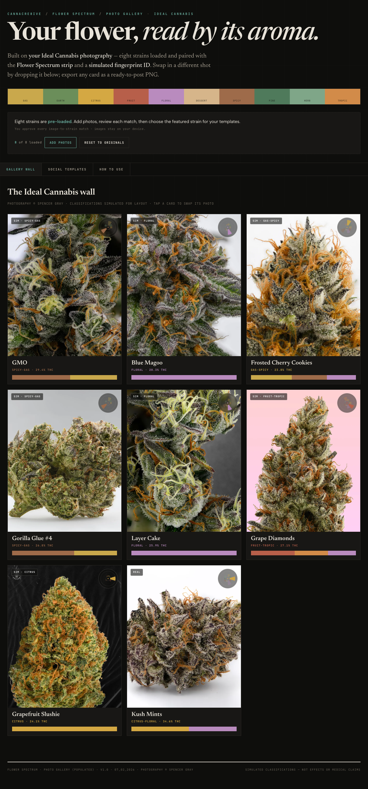
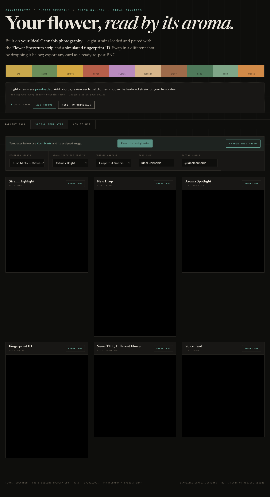

# Flower Spectrum Studio

A browser-based photo gallery and social creative generator for Ideal Cannabis. It pairs strain photography with Flower Spectrum strips and fingerprint visuals, then exports six ready-to-post social formats.

**Live preview:** [flower-spectrum-studio.vercel.app](https://flower-spectrum-studio.vercel.app)

## What changed in v1.1

- Added an upload review dialog with image thumbnails and an explicit strain selector for every file.
- Added a clear “Change this photo” action beside the featured-strain control.
- Kept all uploaded images local to the browser; nothing is sent to a server.
- Fixed PNG export rendering every template twice.
- Escaped quotes in user-controlled filenames and labels before inserting them into HTML.

## Preview





## Run locally

```bash
npm run dev
```

Then open [http://localhost:4173](http://localhost:4173).

## Using your own photography

1. Select **Add photos**.
2. Review each thumbnail and choose its strain from the dropdown.
3. Select **Apply photos**.
4. Open **Social Templates** and choose the featured strain.
5. Use **Change this photo** whenever you want to replace only the selected strain’s image.

Uploaded files are represented with temporary browser object URLs. Refreshing the page restores the embedded originals.

## Classification notice

Most Flower Spectrum classifications in this demonstration are simulated and labeled `SIM`; they are not lab results or medical/effect claims. Kush Mints uses the validated example panel and is labeled `REAL`.
